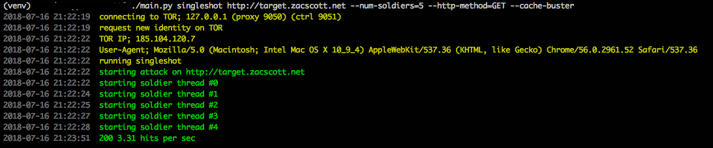

# DoS over TOR

Proof of concept denial of service over TOR stress test tool. Is multi-threaded and supports multiple attack vectors.

## Usage

    $ ./main.py <mode> <target URL> [--options]

There are three modes:

 - `singleshot` - Naively hit a single URL
 - `fullauto` - Scrape the site for links and hits as many as possible
 - `slowloris` - [Slow Loris](https://web.archive.org/web/20090822001255/http://ha.ckers.org/slowloris/) low bandwidth
    DoS

Options:

 - `--tor-address` - TOR proxy IP to connect via (default = 127.0.0.1)
 - `--tor-proxy-port` - TOR proxy port to connect via (default = 9050)
 - `--tor-ctrl-port` - TOR control port to connect to for requesting new idents etc. (default = 9051)
 - `--num-soldiers` - The number of soldier threads to spawn (default = 10)
 - `--http-method` - The HTTP method to use for requests, e.g. GET, HEAD, POST, etc. (default = GET)
 - `--cache-buster` - Add a cache busting query string to all requests (default = False)
 - `--num-sockets` - Number of sockets to open per thread for Slow Loris attacks (default = 100)

### Example

Running a slow loris attack:

    $ ./main.py slowloris http://target_url --num-soldiers=25 --cache-buster --num-sockets=200

Running a full auto attack:

    $ ./main.py fullauto http://target_url --num-soldiers=50 --http-method=POST --cache-buster

## TODO

[ ] Travis CI set up
[ ] Application specific attacks - e.g. https://www.exploit-db.com/exploits/43968/
[ ] Monitor to work out bytes sent / received
